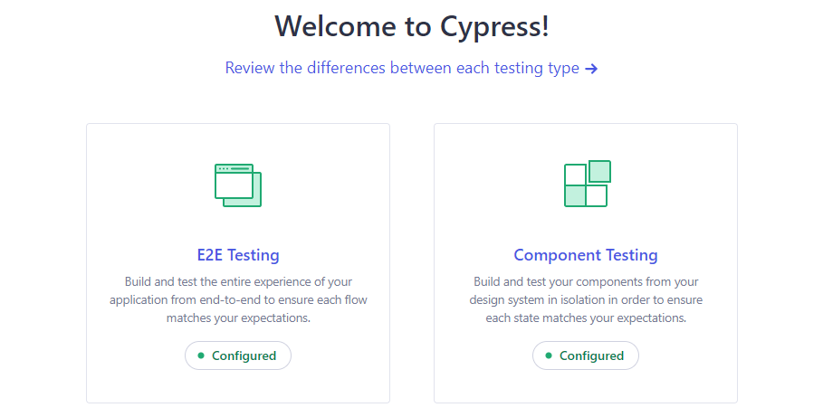
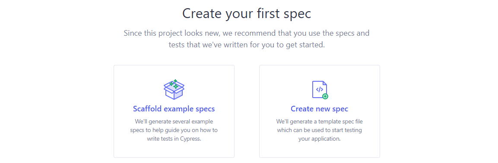
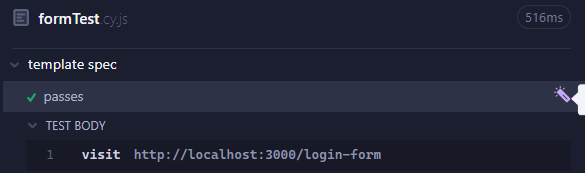

# Project Name

A brief description of your project.

## Table of Contents

- [Introduction](#introduction)
- [Features](#features)
- [Getting Started](#getting-started)
- [Setup Steps](#setup-steps)
- [Generating End-To-End Tests](#generating-end-to-end-tests)
- [Generating Component Tests](#generating-component-tests)
- [Contributing](#contributing)

## Introduction

Welcome to the Cypress Testing Template for Nuxt! Streamline your testing process with our comprehensive template repository designed specifically for Cypress component and end-to-end (E2E) testing in Nuxt. Whether you're a seasoned developer or just starting out, this template provides a solid foundation for writing robust and reliable tests for your Nuxt applications. With this template, you'll have everything you need to quickly set up your testing environment and write effective tests.

## Features

- Generating E2E Tests
- Run tests automatically before every push

## Getting Started

Provide instructions on how to get started with your project. Include any prerequisites, installation steps, and setup instructions. If necessary, provide code examples to guide users through the process.

## Setup steps

Navigate into your project folder:

```
cd your-project-folder
```

Install the dependencies:

```
npm install
```

Start the development server:<br/>
<sub>make sure this is running on "localhost:3000"</sub>

```
npm run dev
```

## Generating End-To-End Tests

In this paragraph we wil go over how to generate E2E tests.

1.  Start by opening the Cypress Terminal

    ```
    npx cypress open
    ```

    This will open the terminal.

2.  From here pick E2E Testing<br/><br/>
    
3.  Pick your prefered browser and click "start testing"<br/>

    

4.  To start generating your own tests click create new spec and give it a name.
    <p>I'll name mine formTest.cy.js for this example</p>
    <p>After this the file will be created in your "cypress/e2e" folder.</p>
5.  Here you can change the visit action to your desired route<br>
    In this example we'll use the "/login-form" page.
6.  Click "Add Commands to Test"<br/>
    
    <p>( That's the magic wand on the right )</p>
7.  From here on interact with the DOM on the right in the way you want to test.
    <p>( Don't forget that you can right click to define assertion ).<br/>But you probably already knew that because you read the DOCS right ;)</p>
8.  Your last step is clicking "Save Commands"
    <p>You can now rerun your tests in the terminal</p>

## Generating Component Tests

In this paragraph we wil go over how to generate Component tests.

The steps are practically the same as when you generate e2e tests.

To automatically generate the test in cypress studio you can follow the same steps an press "copy code" on step 8.

After that just paste these steps in a new file that follows the correct naming scheme '[your-component-name].cy.js' and then you can check and rerun them in the component dashboard.

Any further more advanced assertions can be added in your cy.js file.

## Push and Commit

The next step is already configured for you.
whenever you push to a remote repository all tests run automatically.

### Do you want to change this behavior?

Currently the snippet in package.json looks like this:

```
  "pre-push": [
    "cypress:run-e2e",
    "cypress:run-component"
  ],
  "pre-commit": [],
```

All you have to do to change it to run all tests on every commit is move the scripts.

```
  "pre-push": [],
  "pre-commit": [
    "cypress:run-e2e",
    "cypress:run-component"
    ],
```

### Want to be sneaky and push without running tests ?

Even though this is not recommended, because it goes against the whole use of this project...
You can push without testing by 'adding --no-verify' to your push, like this:

```
// for push
git push --no-verify
// for commit
git commit -am "test commit" --no-verify
```

## Future Updates / How to contribute

- Add Snapshot tests
- Add random generating of filled in values
- More ideas? let me know!

## Happy Testing !

### Greetz

### ~ Feniks
